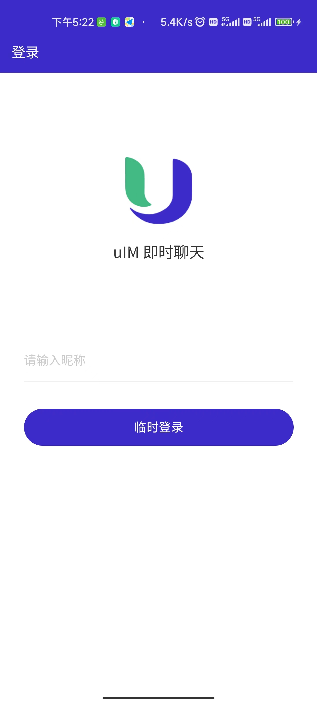
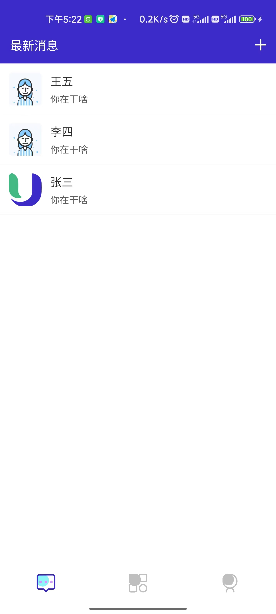
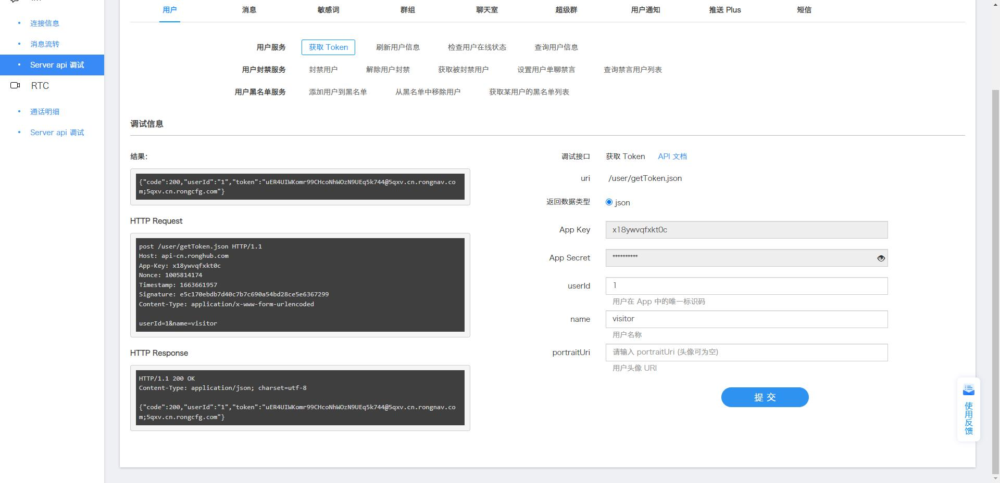

<div align="center">
  <a href="https://github.com/kaivanwong/u-im" target="_blank">
    
  </a>
</div>

<div align="center">
  <h1>uIM 即时聊天</h1>
  <div>
	
  基于 uniapp 的融云即时聊天 Demo 用例

  [](./LICENSE)
  [](https://github.com/kaivanwong/u-im)

  </div>
</div>

### ✨ 特性

- 基于 uniapp 的移动跨端技术，一套代码实现 Android / IOS 跨端 App；

- 集成融云即时通讯 SDK uni 原生插件V2、融云IM原生插件包装层；

- 提供完整的即时通讯界面 Demo 和 融云即时通讯使用方法；

### 📌 功能页面

- [ ] 登录/注册页面、微信登录页面

- [ ] 最新消息列表

- [ ] 通讯录页面

- [ ] 我的界面（个人资料、设置等）

- [ ] 聊天界面

### 🌰 界面展示

<table>
    <tr>
        <td></td>
        <td></td>
    </tr>
</table>

### 🌈 使用

#### 1. 融云开发者账户

融云开发者账户是使用融云 SDK 产品的必要条件。在开始之前，请先 [前往融云官网注册开发者账户](https://developer.rongcloud.cn/signup)。注册后，开发者后台将自动为您创建一个应用，默认为开发环境应用，使用国内数据中心。请获取该应用的 App Key，在本教程中使用。

应用的 App Key / Secret 是获取连接融云服务器身份凭证的必要条件，请注意不要泄露。

#### 2. 安装融云 SDK 自定义基座

首选在 [融云 V2 插件市场](https://ext.dcloud.net.cn/plugin?id=9227#) 进行项目绑定，点击 `购买 for 云打包`，选中需要绑定的项目。

在HBuilderX里找到项目，在manifest的app原生插件配置中勾选模块，如需要填写参数则参考插件作者的文档添加。在代码中引用插件，调用插件功能。

打包自定义基座，选择插件，得到自定义基座，然后运行时选择自定义基座，进行log输出测试。

#### 3. 初始化 SDK

初始化时需要传入上文获取的 App Key。引擎配置请参见[官方文档]()。
 
#### 4. 调用接口

由于本项目没有起后台服务，只是作为 Demo 使用。因此您可以通过融云的 [北极星服务](https://developer.rongcloud.cn/imServerApi/index/wzvF0APxpe_3FQ4fYbI4dw?_sasdk=fMjM3NDAy) 进行接口手动调用。

例如，您可手动获取 Token 调用：



例如，拿到 Token 后手动写入方法中使用：

```javascript
// 连接融云 IM 方法
let code = await engine.connect(
	'uER4UIWKomr99CHcoNhWOw5YR8QIDH0+@5qxv.cn.rongnav.com;5qxv.cn.rongcfg.com',
	10
);
```

**注意事项：**

 - 具体 SDK 使用方法，参照 [插件市场文档](https://ext.dcloud.net.cn/plugin?id=9227)。

 - 安卓测试证书目录为 `/certificate/test.keystore`，密码为 123456，别名为 testalias。

 - 使用HBuilderX2.7.14以下版本，如果同一插件且同一appid下购买并绑定了多个包名，提交云打包界面提示包名绑定不一致时，需要在HBuilderX项目中manifest.json->“App原生插件配置”->”云端插件“列表中删除该插件重新选择。

### 🧣 开源协议

[MIT licensed](./LICENSE) © 2022-PRESENT Kaivan Wong
